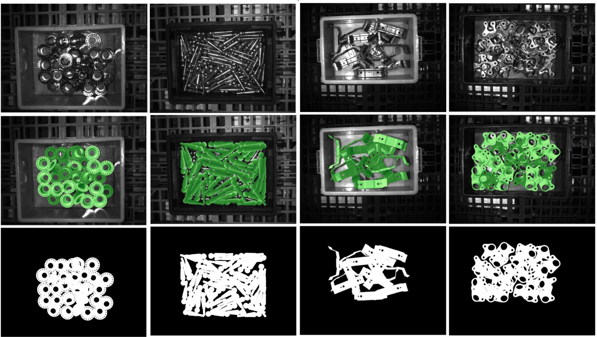
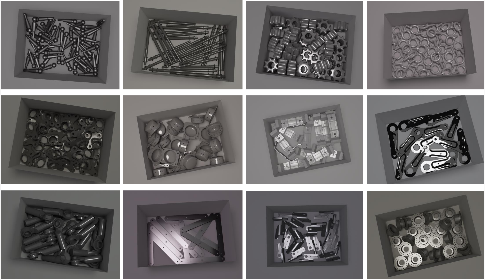

<p align="left">
  
  
</p>

# XYZ-IBD: A High-precision Bin-picking Dataset for Object 6D Pose Estimation Capturing Real-world Industrial Complexity

Welcome to the official repository of **XYZ-IBD**, a bin-picking dataset that captures **real-world industrial complexity** for 6D pose estimation.

**🔥 Note in this repo, we provide the Docker usage for our bin-picking simulation rendering. The code is based on the [BlenderProc](https://github.com/DLR-RM/BlenderProc).**


## 📦 Dataset Access

- 🔗 **Project Page**: [xyz-ibd.github.io/XYZ-IBD](https://xyz-ibd.github.io/XYZ-IBD)
- 🤗 **Hugging Face**: [bop-benchmark/xyzibd](https://huggingface.co/datasets/bop-benchmark/xyzibd)


## 🏆 Ongoing Challenges

- **Model-based 2D/6D Object Detection**  
  [BOP Challenge 2025 (Industrial Track)](https://bop.felk.cvut.cz/challenges/)

- **Monocular Depth Estimation**  
  [TRICKY Challenge 2025 (Monocular Depth Track)](https://sites.google.com/view/iccv25tricky/home#h.9sn9fynz7to1)


## 🚀 Baseline Implementations

We provide reference implementations to kick-start research and benchmarking.
Please refer to the [baseline repository](https://github.com/GodZarathustra/Baselines-for-Industrial-Bin-Picking-BOP2025) for the running details.


## 🛠️ Data Processing & Evaluation

- 📊 **BOP Toolkit Integration**  
  XYZ-IBD is prepared with BOP format(see [here](https://github.com/thodan/bop_toolkit/blob/master/docs/bop_datasets_format.md) for the data format details), and is fully compatible with the [bop_toolkit](https://github.com/thodan/bop_toolkit) for:
  - Data loading and visualization
  - Evaluation on BOP Metrics

- 📊  **2D Detection and 6D Pose Evaluation Server**  
  Submit your predictions for evaluation on the official BOP server:  
  [https://bop.felk.cvut.cz/login/?next=/sub_upload/](https://bop.felk.cvut.cz/login/?next=/sub_upload/)

- 📊  **Monocular Depth Evaluation**  
  Participate in monocular depth leaderboard on Codalab:  
  [https://codalab.lisn.upsaclay.fr/competitions/22870](https://codalab.lisn.upsaclay.fr/competitions/22870)


## Docker usage for our bin-picking simulation rendering

### Build Docker
 ```python
cd docker 
docker build -t "render_xyz_synthetic" .
```
### Run Docker
```python
docker run --gpus all render_xyz_synthetic
cd "examples\datasets\deep-tote"
### Modify the OUTPUT_DIR and OBJECT FILE in config.yaml to your custom path before run scripts!

### Generate the whole synthetic dataset for all objects
blenderproc run render.py --config=config.yaml
### Generate the synthetic dataset for specific object
blenderproc run custom.py --config=config_photoneo_qiuxiao1.yaml
### Post Process the synthetic dataset to BOP Format
blenderproc run gen_masks.py --config=config_photoneo_qiuxiao1.yaml
```


---
> ✨ Let’s push the boundaries of robotic perception in cluttered industrial environments!
## 📫 Contact

For questions, issues, or collaboration inquiries, feel free to open an issue or reach out via the project page.
